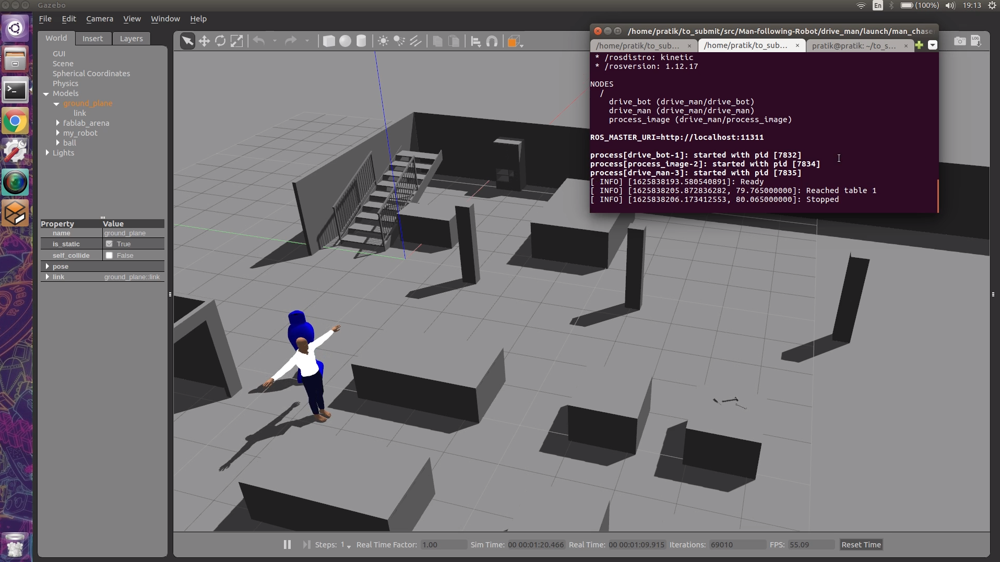

# Man-following-Robot
## Overview

Robot locate and follow an human target moving in an environment. Whenever the person is detected in front, the robot will follow the person in that particular direction.

In this example first it moves to Table-1 in the gazebo world (i.e. Machinery lab in this examlpe) and then randomly walks anywhere for 7 meters.
* It contains a c++ script `process_image.cpp` that processes human infront and calls the command_robot service to drive the robot in the specified direction.
* Also contains `drive_man.cpp` that moves human in the gazebo world according to path we provide.

## Software Requirements

1. Ubuntu 16.04
2. ROS Kinetic

## Build and Complie

To create a new workspace faby_ws, open a terminal and run the following commands:

``` bash
mkdir -p ~/robot_ws/src
cd ~/robot_ws/src/
git clone https://github.com/Prat33k-dev/Man-following-Robot.git
cd ..
catkin_make
source devel/setup.bash
```

## To launch world and nodes execute:
```
cd ~/robot_ws
roslaunch my_robot world.launch
roslaunch drive_man man_chaser.launch
````

### To configure man's movements (option)
There are three basic function in **class** - 

* `moveforward(meters)` : To move forward in meters specified
* `turnleft(degrees)` : To turn man left in degrees
* `turnright(degrees)` : To turn man left in degrees

You can choose from above functions in class to move man around gazebo world

## Output
* When running the `drive_man.launch` you will get message as shown



### Demo video

